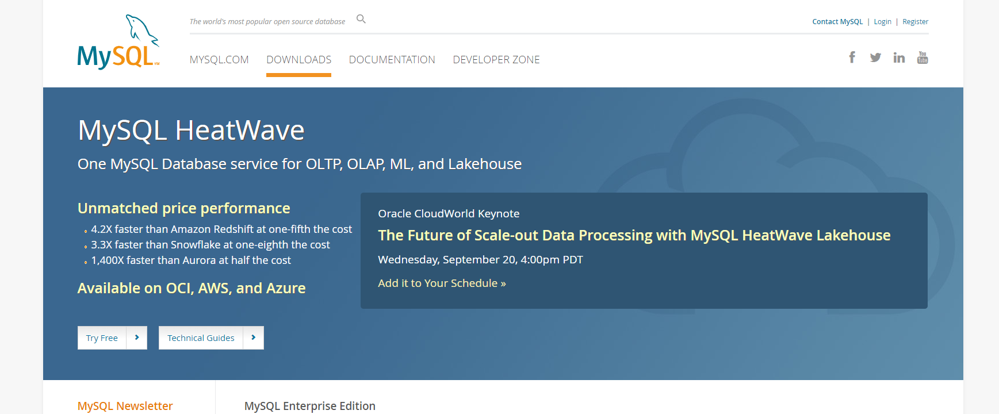
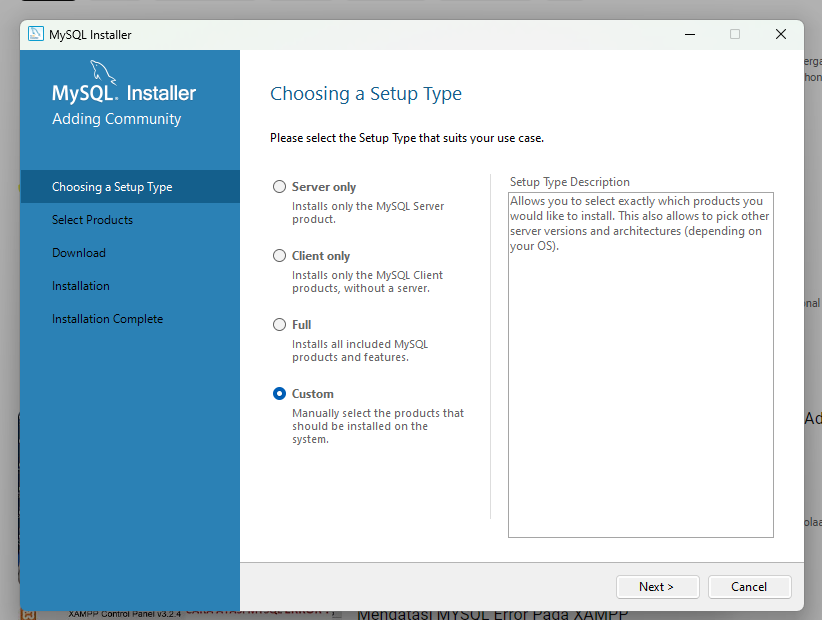
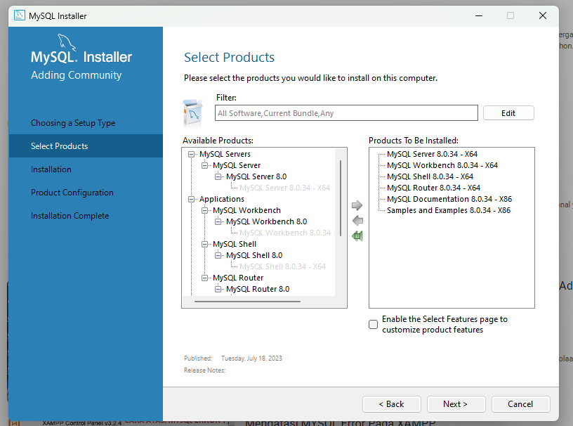
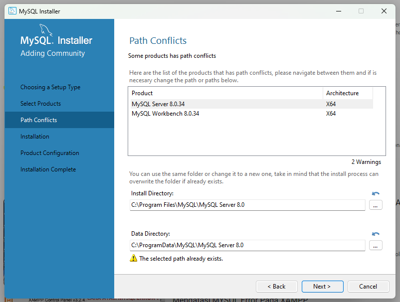
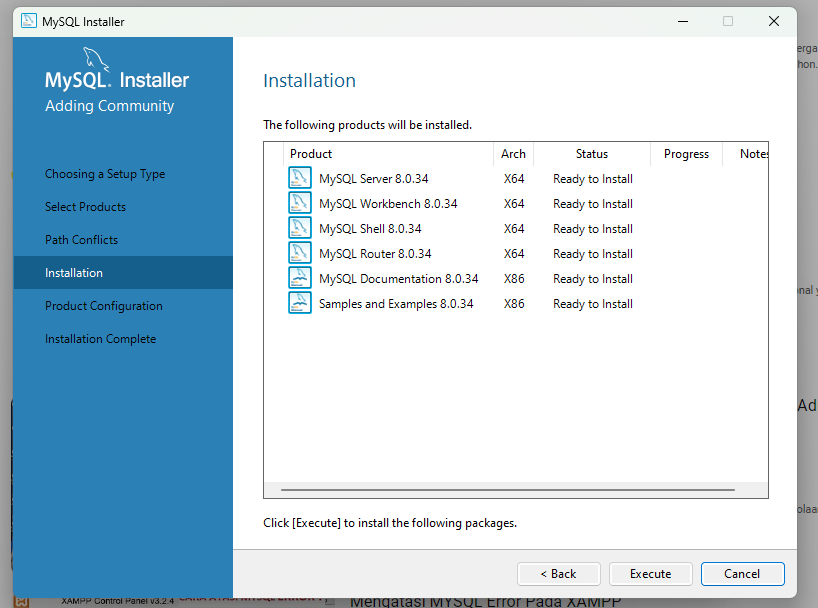
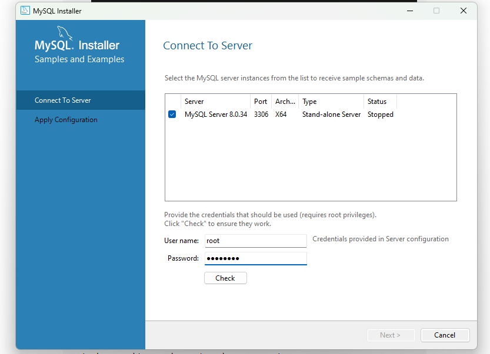
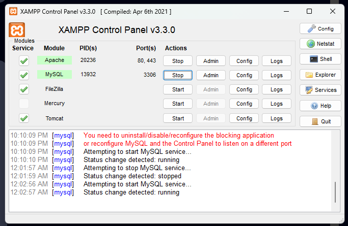
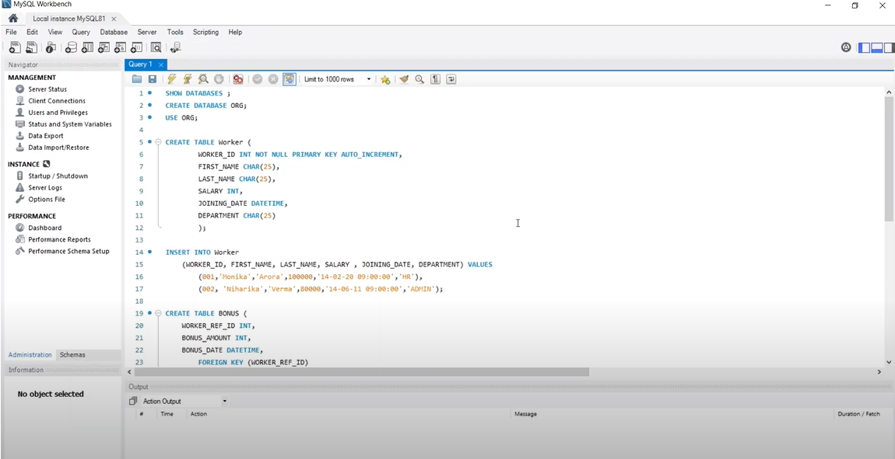
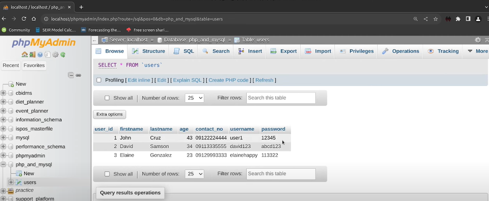
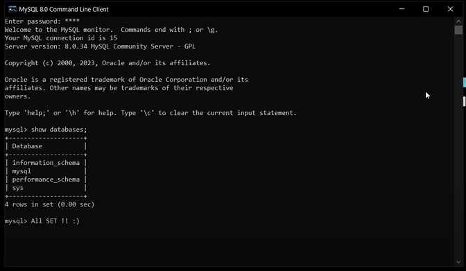

<!DOCTYPE html>
<html>
<head>
  <title>Website Profesional</title>
  
</head>
<body>
  <header>
    <h1>Agus Wahid Fatoni</h1>
  </header>
  
  <nav>
    <ul>
      <li><a href="#">Beranda</a></li>
      <li><a href="#">Tentang Kami</a></li>
      <li><a href="#">Layanan</a></li>
      <li><a href="#">Kontak</a></li>
    </ul>
  </nav>
  
  

    
    <main>
      <h2>Selamat datang di tugas ku</h2>
      
Website ini untuk pengumpulan tugas praktikum basis data dari pertemuan 1 s/d pertemuan 14

      
Jangan lupa untuk bantu konten kami agar selalu relevan dan menarik untuk pengunjung website ku.

    </main>
  

  <footer>
    &copy; 2023 Website Yang tau tau aja. All rights reserved.
  </footer>
</body>
</html>

<!DOCTYPE html>
<html>
<head>
    <title>Cara Install MySQL</title>
</head>
<body>
    <h1>Cara Install MySQL</h1>

    <h2>Langkah 1: Unduh MySQL</h2>
    
Kunjungi situs resmi MySQL di <a href="https://www.mysql.com/downloads/" target="_blank">https://www.mysql.com/downloads/</a> dan unduh paket instalasi MySQL yang sesuai dengan sistem operasi Anda.

    

    <h2>Langkah 2: Jalankan Instalasi</h2>
    
Setelah unduhan selesai, jalankan file instalasi MySQL yang telah Anda unduh. Ikuti petunjuk instalasi yang muncul di layar.

    
    
    
    
    

    <h2>Langkah 3: Konfigurasi Instalasi</h2>
    
Pada proses instalasi, Anda akan diminta untuk mengatur konfigurasi MySQL dan menjalankan server melalui xampp Pastikan Anda memilih opsi yang sesuai dengan kebutuhan Anda, seperti pengaturan password root dan pengaturan port.

    
    

    <h2>Langkah 4: Konfigurasi Php</h2>
    
Setelah konfigurasi selesai, tunggu hingga proses instalasi selesai dan localhost sudah berjalan.

    

    <h2>Langkah 5: Verifikasi Instalasi</h2>
    
Untuk memastikan instalasi MySQL berhasil, buka command prompt atau terminal dan jalankan perintah berikut:

    <pre>
    <code>
        
    </code>
    </pre>

    
Jika MySQL terinstal dengan benar, Anda akan melihat versi MySQL yang terpasang.

    <h2>Langkah 6: Mulai Menggunakan MySQL</h2>
    
Setelah instalasi selesai, Anda dapat mulai menggunakan MySQL dengan menjalankan command-line client atau menggunakan antarmuka grafis seperti MySQL Workbench.

    
    <h2>Referensi</h2>
    <ul>
        <li><a href="https://www.mysql.com/downloads/" target="_blank">https://www.mysql.com/downloads/</a></li>
        <li><a href="https://dev.mysql.com/doc/" target="_blank">https://dev.mysql.com/doc/</a></li>
    </ul>
</body>
</html>
